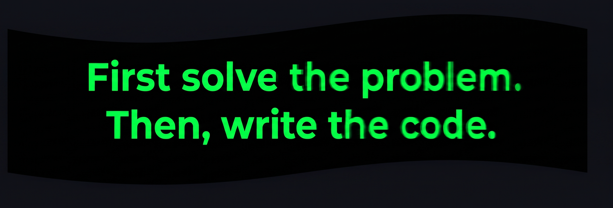

  

&nbsp;

  

<table width="100%">
  <tr>
    <td width="50%" align="center">
      
    </td>
    <td width="50%" align="center">
      
    </td>
  </tr>
</table>

 

**` Frontend `**

&nbsp;

&nbsp;

&nbsp;

 

**` Backend `**

&nbsp;

 

**` Database `**

&nbsp;

 

**` Tools `**

&nbsp;

&nbsp;

---

---

<picture>
  <source media="(prefers-color-scheme: dark)" srcset="https://raw.githubusercontent.com/muhammadshaharyaraulakh/muhammadshaharyaraulakh/output/github-contribution-grid-snake-dark.svg" />
  <source media="(prefers-color-scheme: light)" srcset="https://raw.githubusercontent.com/muhammadshaharyaraulakh/muhammadshaharyaraulakh/output/github-contribution-grid-snake.svg" />
  
</picture>

---

&nbsp;

&nbsp;

  

 
