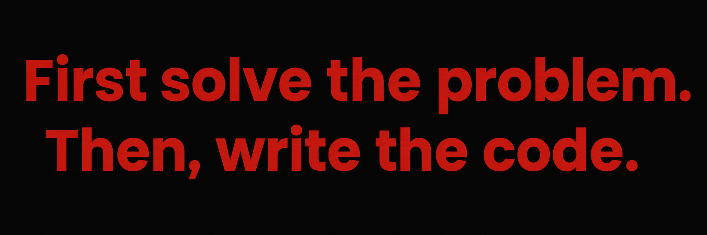

  

    

  

    

  <table width="100%">
    <tr>
      <td width="25%" align="left" valign="top">
         
        
          
        
          
        
          
        
          
        
          
      </td>
      <td width="25%" align="left" valign="top">
         
        
          
        
          
        
          
      </td>
      <td width="25%" align="left" valign="top">
         
        
          
        
          
      </td>
      <td width="25%" align="left" valign="top">
         
        
          
        
          
        
          
        
          
      </td>
    </tr>
  </table>

    

  <table width="100%">
    <tr>
      <td width="50%" align="center">
        
      </td>
      <td width="50%" align="center">
        
      </td>
    </tr>
  </table>

   

  

   

  <picture>
    <source media="(prefers-color-scheme: dark)" srcset="https://raw.githubusercontent.com/muhammadshaharyaraulakh/muhammadshaharyaraulakh/output/github-contribution-grid-snake-dark.svg" />
    <source media="(prefers-color-scheme: light)" srcset="https://raw.githubusercontent.com/muhammadshaharyaraulakh/muhammadshaharyaraulakh/output/github-contribution-grid-snake.svg" />
    
  </picture>

  

